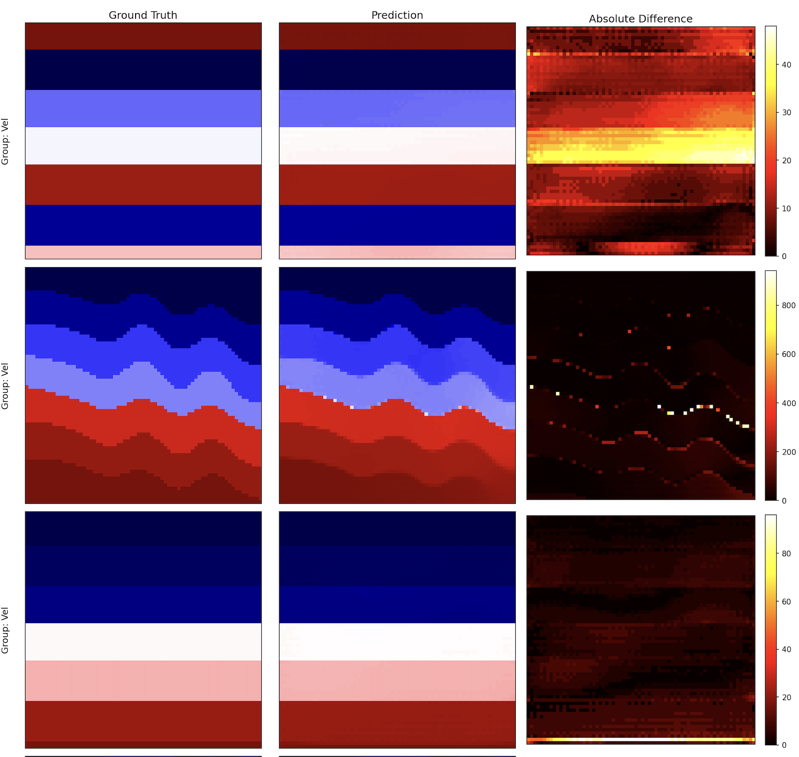
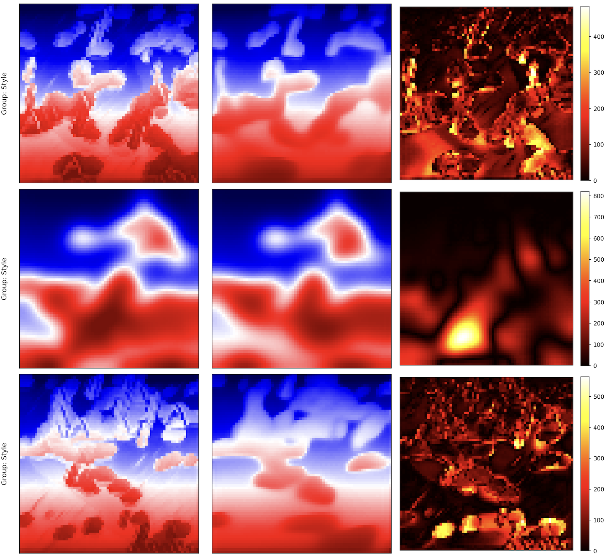
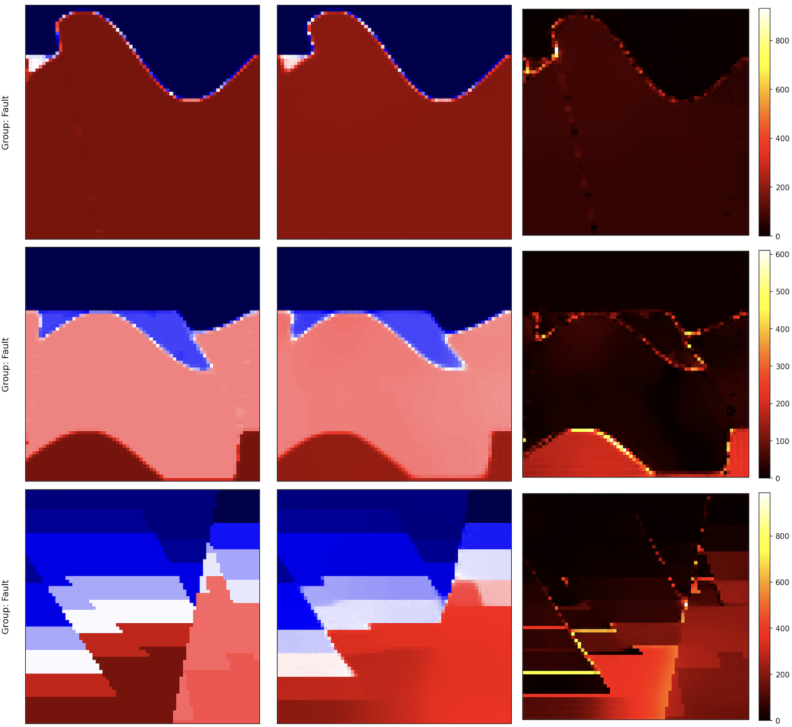

# Geophysical Full Waveform Inversion using Swin-UNet

This repository contains a high-performance, feature-rich PyTorch pipeline for training a deep learning model for Full-Waveform Inversion (FWI) using the OpenFWI dataset. The model, based on a U-Net architecture with a **Swin Transformer v2** backbone, predicts subsurface velocity models from multi-source seismic data.

The codebase is designed for robustness and performance, incorporating modern deep learning techniques such as Distributed Data Parallel (DDP), `torch.compile`, mixed-precision training, and advanced data augmentation.

## Key Features

### Advanced Model Architecture

A U-Net style model with a powerful, pretrained Swin Transformer v2 encoder and an enhanced decoder featuring learned upsampling, residual blocks, and SCSE attention.

### High Performance Training

- **Distributed Data Parallel (DDP)** support for efficient multi-GPU training.
- **Automatic Mixed Precision (AMP)** with `bfloat16` for faster training and reduced memory usage.
- **`torch.compile` Integration**: Leverages PyTorch 2.0+ for significant speedups.
- **Optimized Data Loading**: High-performance `DataLoader` with persistent, pre-fetching workers.

### Comprehensive Loss Function

The combined loss function is a comprehensive combination of loss functions to provide the best (yet) performance:

$$ \mathcal{L}_{\text{Combined}} = \alpha \cdot \mathcal{L}_{\text{Huber}} + \beta \cdot \mathcal{L}_{\text{Gradient}} + \gamma \cdot \mathcal{L}_{\text{TV}} $$

- **Huber loss** for robust regression (i.e., accurate overall reconstruction)
- **Gradient loss** for structural preservation (i.e., preserve sharp details)
- **Total variation loss/regularization** for smooth outputs (i.e., smooth out noise without blurring edges)

### State of the Art (SOTA) Techniques

- **Advanced LR Scheduling**: Cosine Annealing with Warm Restarts and a linear warmup phase.
- **Exponential Moving Average (EMA)** of model weights for improved generalization.
- **Gradient Clipping** and accumulation for stable training.

### Sophisticated Data Handling

- **Rich GPU-Based Augmentations**: Includes elastic deformation, fault simulation, Gaussian noise, and amplitude jitter.
- **Adaptive Augmentation**: Dynamically adjusts augmentation strength based on validation performance.
- **Stratified Data Splitting**: Maintains the proportion of different data groups between training and validation sets.

### Comprehensive Experiment Management

- **Centralized Configuration**: All parameters are managed in a single `Config` class.
- **Robust Checkpointing**: Save and resume training, including optimizer, scheduler, and RNG states.
- **Detailed Logging**: Logs to console, file, and TensorBoard for real-time monitoring.
- **Automated Visualization**: Generates plots of training metrics and validation predictions.
- **ONNX Export**: Easily export the final model for deployment.

## Setup and Installation

### 1. Clone the repository

    git clone https://github.com/gk408829/Geophysical-Full-Waveform-Inversion.git
    cd Geophysical-Full-Waveform-Inversion

### 2. Create a virtual environment (recommended):

    python -m venv venv
    source venv/bin/activate

### 3. Install the required dependencies:

A `requirements.txt` file can be created with the following contents.

    # Core DL Framework
    torch
    torchvision
    torchaudio

    # Model and Utilities
    timm
    numpy
    psutil
    scipy
    matplotlib
    torchinfo
    tqdm
    torchmetrics
    tensorboard
    onnx

Install them using pip:

    pip install -r requirements.txt

## Dataset Structure

The script expects the training data to be organized in a specific structure. The root directory contains subdirectories for different data categories (e.g., "Vel", "Style", "Fault"). Each subdirectory contains the input seismic data and target velocity models as `.npy` files.

The script automatically pairs `seis*.npy` with `vel*.npy` or `data*.npy` with `model*.npy`.

    /path/to/your/dataset/
    ├── Vel_Style_1/
    │   ├── seis0.npy
    │   ├── vel0.npy
    │   ├── seis1.npy
    │   └── vel1.npy
    │
    ├── Fault_Models/
    │   ├── data0.npy
    │   ├── model0.npy
    │   ├── data1.npy
    │   └── model1.npy

## Configuration

All hyperparameters and settings are managed in the `Config` class within the script. Before running, update the paths and review the key parameters.

## How to Run

### Single-GPU Training

To run the training on a single GPU, simply execute the Python script:

    python fwi_swinunet_pipeline.py

### Multi-GPU Training (DDP)

For distributed training across multiple GPUs on a single node, use `torchrun`. This script will automatically detect the DDP environment and handle the setup.

    # Replace NUM_GPUS with the number of GPUs you want to use (e.g., 4)
    torchrun --nproc_per_node=NUM_GPUS fwi_swinunet_pipeline.py

## Outputs and Results

The script will create an output directory (specified by `OUTPUT_DIR`) containing the following:

- Log File: A detailed log of the entire training process.
- Checkpoints: 

    - `best_model_ema.pth`: The model state with the best validation score (based on EMA weights).
    - `checkpoint_epoch_*.pth`: Periodic checkpoints saved every `CHECKPOINT_EVERY` epochs.

- TensorBoard Logs:

    tensorboard --logdir /path/to/your/output_dir/tensorboard

- Plots:

    - `*_metrics.png`: A comprehensive plot showing training/validation loss, MAE, learning rate, and gradient norm over epochs
    - `*_predictions.png`: A visual comparison of ground truth velocity models, model predictions, and their absolute difference on a sample of the validation set.

- ONNX Model:

    - `*.onnx`: The final model exported to the ONNX format if `EXPORT_ONNX` is `True`.

## Code Structure

The script is organized into logical, reusable components:

- `Config`: A centralized class for all hyperparameters and settings.
- `DDPManager`: Handles the setup and cleanup of the distributed training environment.
- Data and Preprocessing:

    - `FWIDataset`: Custom PyTorch Dataset for loading `.npy` files efficiently.
    - `GPUBatchProcessor`: Performs all batch processing (normalization, augmentation) on the GPU to maximize throughput.

- Model Architecture (`MultiSourceUNetSwin`):

    - `SCSEBlock`: Squeeze-and-Channel-and-Spatial-Excitation attention module.
    - `LearnedUpsample`: An upsampling block using `PixelShuffle` for higher-quality outputs.
    - `EnhancedUNetDecoderBlock`: A sophisticated decoder block combining upsampling, skip connections, and residual blocks.

- Utilities (`ModelEMA`, `EarlyStopping`, `MetricsLogger`): Helper classes for EMA, early stopping, and logging.

- Loss Function (`CombinedLoss`): A custom loss function combining Huber, Gradient, and Total Variation losses with support for class-based weighting.

- Training and Validation Loops: The core `train_one_epoch` and `validate_one_epoch` functions.

- `main()`: The main execution function that orchestrates the entire pipeline.

## Results and Evaluation

The model trained for 34 out of 50 planned epochs before early stopping trig-gered. The total training duration was approximately 18.23 hours using efficient training technologues like DDP and AMP in 2x `H100` GPUs. The best valida-tion MAE was achieved at Epoch 29 with an overall (average) validation MAE of 63.27 m/s:

|Metric             | Loss   |   MAE   | Grad Norm | SSIM   |
|-------------------|--------|---------|-----------|--------|
|Train (Avg)        | 0.0375 |   66.69 | 0.08      | -      |
|Val "Vel" Group    | 0.0141 |   43.07 | -         | 0.8725 |
|Val "Style" Group  | 0.0232 |   69.82 | -         | 0.9188 |
|Val "Fault" Group  | 0.0253 |   76.94 | -         | 0.8844 |

Table: Best EMA model {#tbl-best-model}

The model achieved its best overall validation MAE of 63.27 at Epoch 29. This significant reduction from an initial MAE of 308.34 in Epoch 1 demonstrates the effectiveness of the combined loss function, ro-bust architecture, and comprehensive augmentation strategy. 

| **Metric**            | **Epoch 1**  | **Epoch 5**  | **Epoch 10** | **Epoch 13** | **Epoch 20** | **Epoch 29** | **Epoch 3**4 |
|-------------------|----------|----------|----------|----------|----------|----------|----------|
| Train Loss    | 0.1154   | 0.0659   | 0.0508   | 0.0462   | 0.0446   | 0.0375   | 0.0418   |
| Train MAE     | 439.84   | 157.19   | 102.60   | 88.68    | 84.61    | 66.69    | 77.88    |
| Overall Val MAE | 308.34 | 126.90   | 85.95    | 79.90    | 70.42    | **63.27** | 64.97   |
| Val Vel MAE   | 398.78   | 134.28   | 70.91    | 61.36    | 51.97    | 43.07    | 47.37    |
| Val Style MAE | 191.19   | 105.33   | 84.34    | 81.46    | 73.99    | 69.82    | 69.50    |
| Val Fault MAE | 335.04   | 141.08   | 102.61   | 96.88    | 85.29    | 76.94    | 78.05    |
| Val Vel SSIM  | 0.4973   | 0.7426   | 0.8196   | 0.8311   | 0.8583   | 0.8725   | 0.8714   |
| Val Style SSIM| 0.7389   | 0.8542   | 0.8919   | 0.8966   | 0.9116   | 0.9188   | 0.9214   |
| Val Fault SSIM| 0.6343   | 0.8011   | 0.8500   | 0.8556   | 0.8756   | 0.8844   | 0.8864   |

Table: Model training metrics across epochs {#tbl-epoch-metrics}

Furthermore, we observed a consistent reduction in MAE across all three prediction tasks (Vel, Style, and Fault) and a corresponding increase in SSIM, indicating improved structural similarity between predictions and ground truth.

### Predicted Velocity Maps

Across all displayed samples and groups, the predicted images closely resemble their corresponding actual counterparts. The model appears to maintain a good level of sharpness and detail in its predictions, especially for complex geological structures. The diversity of the samples shown (ranging from layered structures to more complex, chaotic patterns) suggests that the model has done a good job in generalizing the various geological scenarios within the dataset.

#### "Vel" Family

The “Vel” samples show excellent (best of the three) agreement between ground truth and prediction. The layered structures are accurately repro-duced, and the transitions between different velocity zones are smooth and well-defined.

#### "Style" Family

The “Style” samples, which appear to represent more abstract or textural properties, are also well-predicted. The model captures the overall “flow” and patterns, even in intricate designs.

#### "Fault" Family

The “Fault” samples demonstrate the model’s ability to delineate complex fault structures. The predictions successfully capture the presence and general orientation of the faults, which are critical for geo-logical interpretation.

## Citation

If you use this code in your research, please cite:

    @misc{swinunet2025,
        author = {Gaurav Khanal},
        title = {Swin-UNet: Full Waveform Inversion with Swin Transformers},
        year = {2025},
        publisher = {GitHub},
        journal = {GitHub repository},
        howpublished = {\url{https://github.com/gk408829/Geophysical-Full-Waveform-Inversion}}
    }

